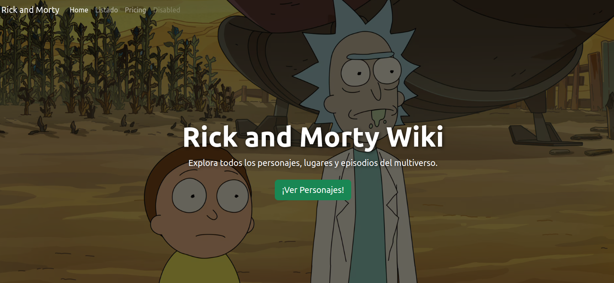
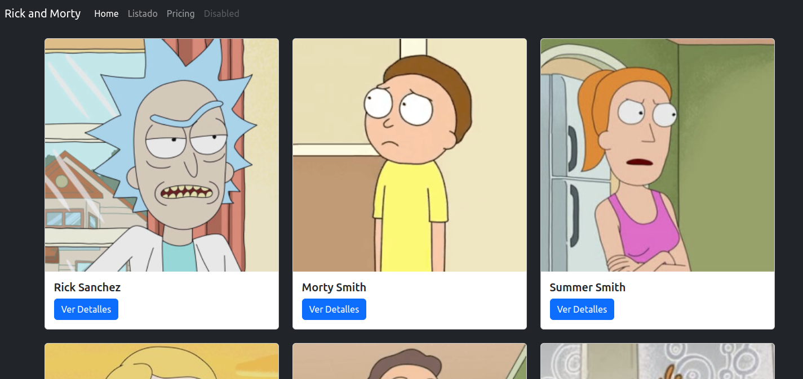

# Angular20RickandmortyNavbarTransparent

This project was generated using [Angular CLI](https://github.com/angular/angular-cli) version 20.0.1.



#### **b) Los Estilos CSS (`home.component.scss`)**

Aquí es donde crearemos la magia del fondo con imagen y el texto superpuesto.

Abre `src/app/pages/home/home.component.scss` y añade los siguientes estilos:

```scss
.hero-section {
  // 1. Ocupar toda la altura de la ventana del navegador.
  height: 100vh;

  // 2. Imagen de fondo.
  // Reemplaza esta URL con la imagen que prefieras.
  background-image: url('https://images.alphacoders.com/876/876359.jpg');
  background-size: cover; // Asegura que la imagen cubra todo el contenedor.
  background-position: center; // Centra la imagen.
  background-repeat: no-repeat; // Evita que la imagen se repita.

  // 3. Usar Flexbox para centrar el contenido vertical y horizontalmente.
  display: flex;
  justify-content: center;
  align-items: center;

  // 4. Posicionamiento relativo para la superposición semitransparente.
  position: relative;
}

// 5. Crear una capa oscura semitransparente sobre la imagen de fondo.
.hero-section::before {
  content: ''; // Requerido para que el pseudo-elemento se muestre.
  position: absolute;
  top: 0;
  left: 0;
  width: 100%;
  height: 100%;
  background-color: rgba(0, 0, 0, 0.6); // Fondo negro con 60% de opacidad.
  z-index: 1; // Coloca la capa por debajo del contenido.
}

.hero-content {
  // 6. Asegurar que el contenido esté por encima de la capa oscura.
  position: relative;
  z-index: 2;

  // 7. Sombra de texto para mejorar la legibilidad.
  h1, p {
    text-shadow: 2px 2px 8px rgba(0, 0, 0, 0.7);
  }
}

// 8. Efecto para el botón al pasar el mouse.
.btn-success {
  transition: transform 0.2s ease-in-out, box-shadow 0.2s ease-in-out;

  &:hover {
    transform: translateY(-3px);
    box-shadow: 0 10px 20px rgba(0, 0, 0, 0.2);
  }
}
```

**Explicación de los Estilos Clave:**

1.  **`height: 100vh`**: Hace que la sección ocupe el 100% de la altura del *viewport* (la parte visible de la ventana del navegador).
2.  **`background-*`**: Estas propiedades configuran la imagen de fondo para que siempre cubra el área sin deformarse ni repetirse.
3.  **`display: flex`...**: Es la forma moderna y más sencilla de centrar perfectamente un elemento (`.hero-content`) dentro de otro (`.hero-section`).
4.  **`position: relative`**: Se establece en el contenedor padre para que el pseudo-elemento `::before` (la capa oscura) pueda posicionarse de forma absoluta *dentro* de él.
5.  **`.hero-section::before`**: Creamos un "falso" elemento que se superpone a la imagen de fondo. Le damos un `background-color` con `rgba` para lograr la transparencia. Esto es crucial para que el texto blanco siempre sea legible, sin importar qué tan clara u oscura sea la imagen de fondo.
6.  **`z-index`**: Usamos `z-index` para controlar el apilamiento. La capa oscura (`z-index: 1`) se sitúa entre la imagen de fondo (que está en `z-index: 0` por defecto) y el contenido de texto (`z-index: 2`).
7.  **`text-shadow`**: Un pequeño truco que añade profundidad y mejora enormemente la legibilidad del texto sobre fondos complejos.
8.  **Efecto `hover`**: Un detalle sutil que hace que la interfaz se sienta más viva e interactiva.
## Development server

To start a local development server, run:

```bash
ng serve
```

Once the server is running, open your browser and navigate to `http://localhost:4200/`. The application will automatically reload whenever you modify any of the source files.

## Code scaffolding

Angular CLI includes powerful code scaffolding tools. To generate a new component, run:

```bash
ng generate component component-name
```

For a complete list of available schematics (such as `components`, `directives`, or `pipes`), run:

```bash
ng generate --help
```

## Building

To build the project run:

```bash
ng build
```

This will compile your project and store the build artifacts in the `dist/` directory. By default, the production build optimizes your application for performance and speed.

## Running unit tests

To execute unit tests with the [Karma](https://karma-runner.github.io) test runner, use the following command:

```bash
ng test
```

## Running end-to-end tests

For end-to-end (e2e) testing, run:

```bash
ng e2e
```

Angular CLI does not come with an end-to-end testing framework by default. You can choose one that suits your needs.

## Additional Resources

For more information on using the Angular CLI, including detailed command references, visit the [Angular CLI Overview and Command Reference](https://angular.dev/tools/cli) page.
# angular20-rickandmorty-navbar-details
